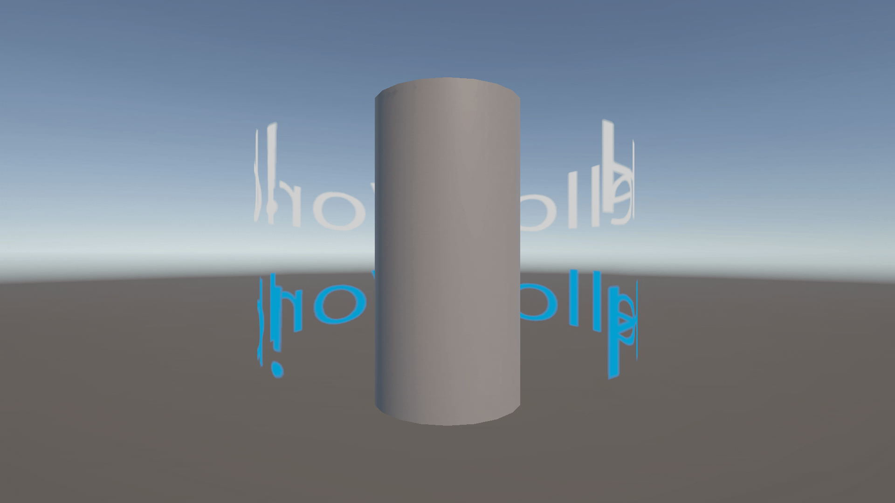
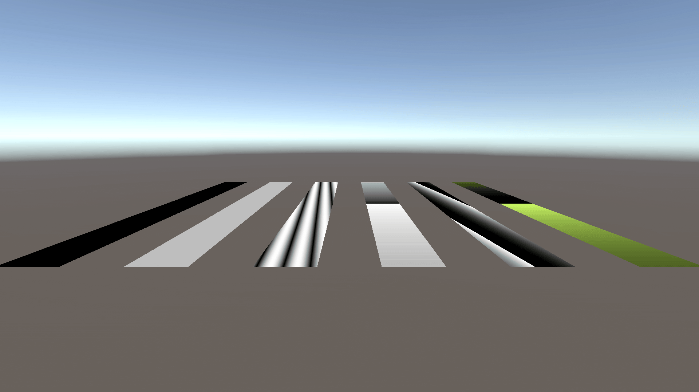
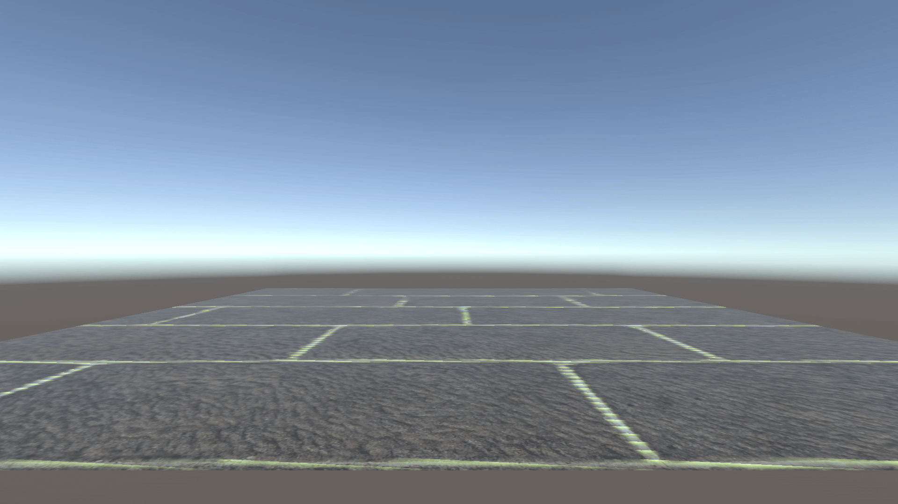
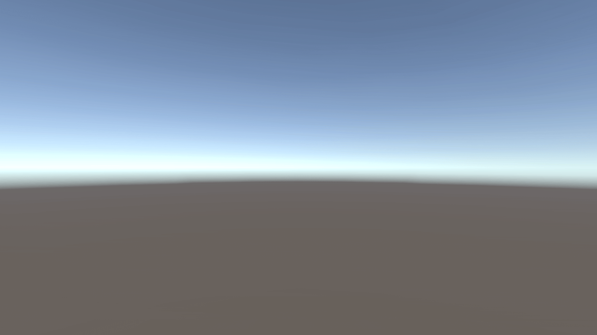

# はじめに
プログラムワークショップIVの管理用です

# 結果画像

- 工夫した点：キューブや球に張り付けたり数値を変えてみました。最初のMovei001は数値をマイナスの値にして反転してみました。
(005)もう一つ撮ってみました。
こっちの方は夢にでてきそうな不思議な雰囲気になったように感じます。

# 進め方

- 本リポジトリをforkしてください
- fork先のリポジトリを更新してください
- Unityのプロジェクトをsrc内で進めてください
- 結果を画面キャプチャして、画像としてリポジトリに追加して、上記のリンクから見られるようにしてください
- 完成したら本リポジトリのmainブランチにpull requestを投げてください
